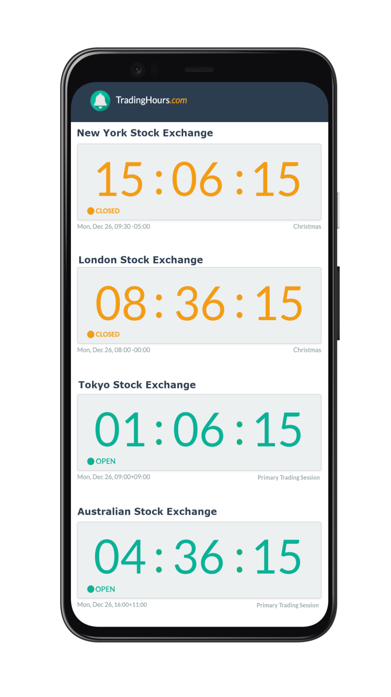
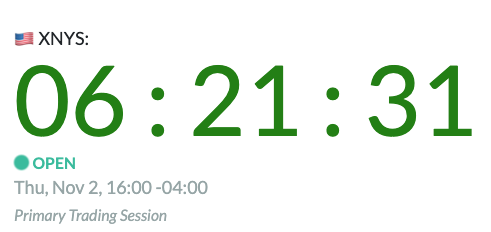
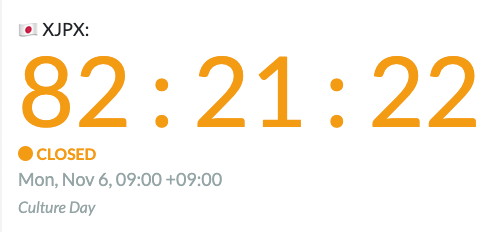
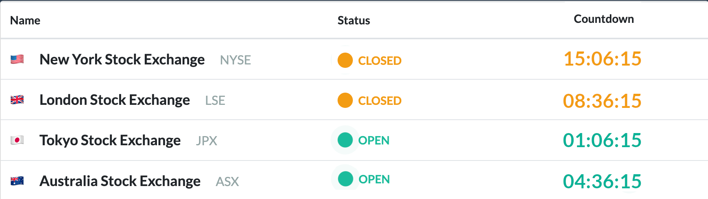

# Market Status

[[toc]]

## Market Status Details
The Market Status API will return, in real-time, the current status of a market, including:
- If a market is open or closed
- When the market opens or closes next
- The current trading phase _(pre-, post-trading session, etc.)_
- If there is currently a holiday or irregular schedule

You can use these details to:
- Build dashboards
- Add countdowns or market status indicators to your website or application
- Activate trading algorithms when markets open
- Detect market holidays and half-days


::: tip Attribution
Attribution to TradingHours.com, including a clearly visible link, is required when displaying data provided by the Market Status API within your website or application.
:::

### Visualization Examples


<br>

<br>
<br>

<br>
<br>



### Schema
| Field | Format | Description |
| ------------- | ------------- | --------- |
| local-time | ISO 8601 | The current local time at the market. <span style="color: red"><b>(Deprecated)</b></span> |
| status | String | `Open` if it is currently a primary trading session. `Closed` otherwise, including for pre- and post-trading sessions. |
| reason | String | Explanation of the current response, including phase(s), holidays, and irregular schedules. |
| until | ISO 8601 | Displays the end of the current phase. |
| next_bell | ISO 8601 | Displays the time when the market opens or closes next. |
| utc_time | ISO 8601 | Displays the time in UTC. <span style="color: red"><b>(Deprecated)</b></span> |
| time | ISO 8601 | Displays the same as "utc_time". <span style="color: red"><b>(Deprecated)</b></span> |
| timezone | String | Timezone of this trading venue (Olson timezone format) |


::: tip Note
`until` is not always the same as `next_bell`. For example, if it is currently a post-trading session, `until` will indicate the end of the post-trading session, and `next_bell` will be the following morning when markets officially open.
:::

### Query String Parameters
Supported query string parameters are listed in the table below:

| Parameter | Supported Values | Default | Description |
| ------------- | ------------- | --------- | --------- |
| fin_id | Valid FinID(s) | N/A | Specify which market(s) to show data for. |
| time | ISO 8601 | Current time | **Enterprise Only** - Specify the time that you'd like the information for. |

### Past & Future Times (Enterprise only)

Use the `time` query string parameter to specify a date and time. The `time` parameter should be in ISO 8601 format. E.g. `2020-02-27T01:23:45-05:00`.

If the `time` parameter is omitted, the current time is used.

The `time` parameter can only be used by clients with access to the [Market Holidays](/3.x/enterprise/market-holidays) and [Trading Hours](/3.x/enterprise/trading-hours) data.

### Caching

The results of the status API will not change until `until`.
It is safe to cache results until this time.
Caching requests and using bulk API calls will help you avoid exceeding the [rate limits](../api-details.md#rate-limits).

### Examples
Remember to use your [authentication token](../authentication.md) for all requests.

#### Get Details for Single FinID

```
https://api.tradinghours.com/v3/markets/status?fin_id=us.nyse
```
#### Get Details for Single MIC
```
https://api.tradinghours.com/v3/markets/status?fin_id=XNYS
```

#### Get Details for Bulk FinIDs
```
https://api.tradinghours.com/v3/markets/status?fin_id=us.nyse,jp.jpx
```

#### Get Details with Defined Time
```
https://api.tradinghours.com/v3/markets/status?fin_id=us.nyse&time=2020-11-27T12:55:00-04:00
```

### Sample JSON Responses

#### Get Details for Single FinID - Holiday Partial Hours
``` json
{
   "data":{
      "US.NYSE":{
         "fin_id":"US.NYSE",
         "exchange":"New York Stock Exchange",
         "market":"Canonical",
         "products":null,
         "timezone":"America/New_York",
         "status":"Open",
         "reason":"Market Holiday - Primary Trading Session (Partial)",
         "until":"2020-11-27T12:45:00-05:00",
         "next_bell":"2020-11-27T13:00:00-05:00"
      }
   }
}
```

#### Get Details for Bulk FinIDs - Closed Market and Open Primary Market
```json
{
    "data": {
        "JP.JPX": {
            "fin_id": "JP.JPX",
            "exchange": "Japan Exchange Group",
            "market": "Tokyo Stock Exchange",
            "products": null,
            "timezone":"Asia/Tokyo",
            "status": "Closed",
            "reason": null,
            "until": "2020-09-14T08:00:00+09:00",
            "next_bell": "2020-09-14T12:30:00+09:00"
        },
        "US.NYSE": {
            "fin_id": "US.NYSE",
            "exchange": "New York Stock Exchange",
            "market": "Canonical",
            "products": null,
            "timezone":"America/New_York",
            "status": "Open",
            "reason": "Primary Trading Session",
            "until": "2020-09-11T15:45:00-04:00",
            "next_bell": "2020-09-11T16:00:00-04:00"
        }
    }
}
```
